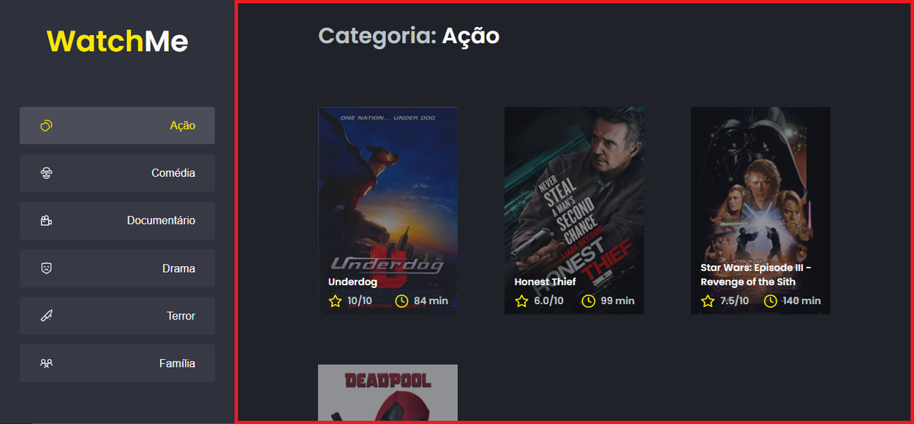
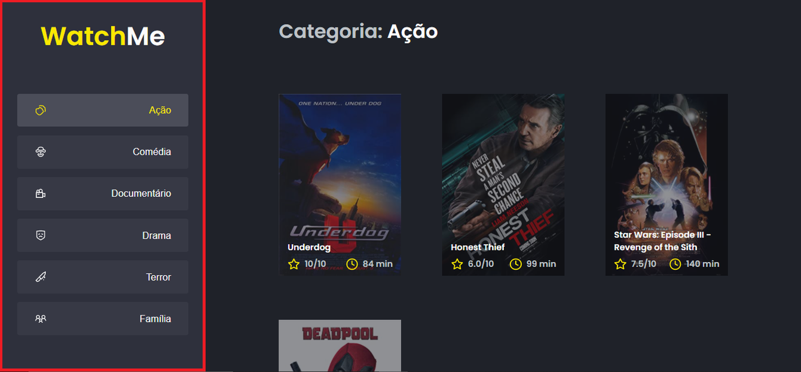

# ReactJS Ignite Challenge Components And Optimizing The Application

Challenge proposed for Ignite on Reactjs trail, from Rocketseat. 

## Pré-requisitos

```
git clone https://github.com/AlanWehrliLC/reactJSigniteChallengeComponentsAndOptimizingTheApplication.git

cd reactJSigniteChallengeComponentsAndOptimizingTheApplication

yarn
```

> Since a `fake api` is used, using `json-server`, after installing as dependencies, use 'two' terminals, one for starting `json-server` and one for an application.

```
yarn server
```
> &
```
yarn dev
```

### What should have been edited in the application?

 - src/App.tsx

 - src/components/Content.tsx

<p align="center">
  
</p>

 - src/components/SideBar.tsx

<p align="center">
  
</p>

 - #### src/hooks/useGenerAndMovies.tsx
   - In addition to making all the necessary modifications, create a context, a hook, to pass information between components.

### Where were the optimizations done?

  - src/components/Button.tsx
    - Using `memo` to optimize the component.
  - src/components/MovieCard.tsx
    - Using `memo` to optimize the component.
  - src/components/SideBar.tsx
    - Using `useCallback` to optimize the component